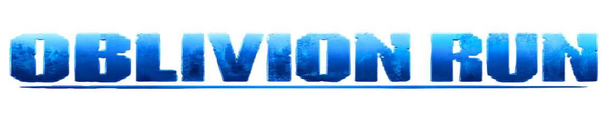

# Oblivion Run

> **Run from the dark. Fight what follows.**
>
> A pixel-art action platformer and endless survival game built with C and
> [raylib](https://www.raylib.com/). Survive a haunted forest, defeat its
> creatures, and push your high score further with every run.

<p align="center">
  
</p>

## The run

Choose a difficulty, name your hero, and head into an endless side-scrolling
forest. Skeletons, spikes, bombs, gaps, and pursuing poison fog all stand
between you and a new record. Jump, dash, and fight to stay alive.

**Highlights**

- Fast-paced platforming with melee combat and a dash
- Skeleton enemies, multiple hazards, and health pickups
- Easy, Medium, and Hard difficulty options
- Procedurally assembled terrain with difficulty that increases over time
- Local top-five high scores
- Keyboard, gamepad, and on-screen touch controls

## Play

**Requirements:** Windows 10 or later, 64-bit MinGW-w64 GCC on `PATH`, and the
raylib files bundled in `third_party/raylib/`. VS Code is optional.

Open PowerShell in the repository root, then build and run:

```powershell
New-Item -ItemType Directory -Force build | Out-Null
gcc.exe -g src/main.c src/game.c src/score.c src/explosion.c src/tutorial.c src/sound.c src/player.c src/enemy.c src/ground.c src/pattern.c src/background.c src/camera.c src/texture.c src/animation.c src/health.c src/combat.c -Isrc -Iinclude -Ithird_party/raylib/include -Lthird_party/raylib/lib -lraylib -lopengl32 -lgdi32 -lwinmm -Wall -Wextra -o build/main.exe
.\build\main.exe
```

Run the game from the repository root so it can find its assets and save scores.
The bundled VS Code build/debug configuration contains a local toolchain path;
on another machine, update that path to your MinGW installation or use the
command above. See **[Getting started](getstart.md)** for setup and
troubleshooting.

## Controls

| Action | Keyboard / mouse | Gamepad |
| --- | --- | --- |
| Move | `A` / `D` or `←` / `→` | Left stick or D-pad |
| Jump | `Space`, `W`, or `↑` | `A` |
| Dash | `Left Shift` or `Right Shift` | `RB` |
| Attack | Left mouse, `Down`, `X`, or `J` | `X`, `LT`, or `RT` |
| Pause / back | `Esc` | `Start` / `B` |

On-screen controls are also available for touch input. Menus can be navigated
with `W` / `S` or the arrow keys and confirmed with `Enter` / `Space`; mouse and
gamepad input are supported too.

## Project map

| Path | Contents |
| --- | --- |
| `src/` | Game loop, screens, player, enemies, world generation, combat, and audio |
| `include/` | Shared game state, types, and tuning constants |
| `assets/` | Sprites, backgrounds, fonts, and sound |
| `data/` | Local high-score storage |
| `third_party/raylib/` | Bundled raylib headers and libraries |
| `.vscode/` | VS Code build and debug configuration |

The technical overview is in **[docs.md](docs.md)**. To help improve the game,
please read **[CONTRIBUTING.md](CONTRIBUTING.md)** and the
**[Code of Conduct](CODE_OF_CONDUCT.md)**. For vulnerability reports, see
**[SECURITY.md](SECURITY.md)**.

## License

See [`license`](license) for the project license. Check individual asset and
dependency terms before redistributing them.
